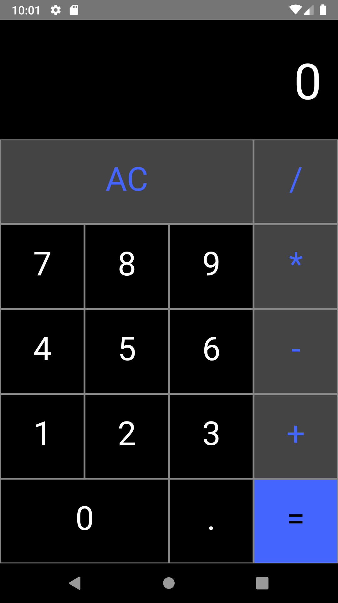

<h1 align="center">
     Calculator
</h1>
<h2 align="center"> React Native <h2>

  <a href="#zap-about">About</a>&nbsp;|&nbsp;
  <a href="#gear-requirements">Requirements</a>&nbsp;&nbsp;&nbsp;|&nbsp;&nbsp;&nbsp;
  <a href="#rocket-run">Run</a>

 

  

## :zap: About

This is a simple react-native calculator with the basic operations.

## :gear: Requirements
-  [React Native](http://facebook.github.io/react-native/)

## :rocket: Run
1. Clone repository

<pre><code>git clone https://github.com/gabriel1997castro/calculator.git</code></pre>

2. Install the dependencies of the application
<pre><code>
  $ yarn # ou npm install
</code></pre>

3. Run
<pre><code>
     yarn start # ou npm start
</code></pre>

